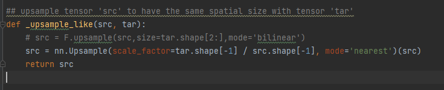
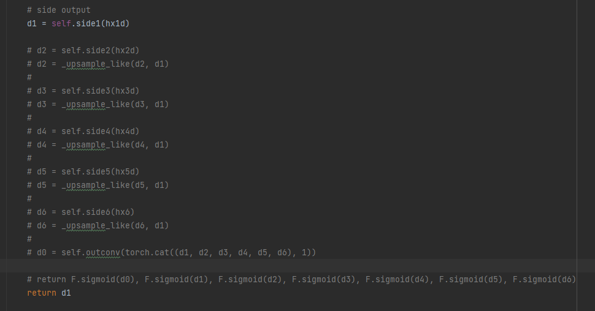
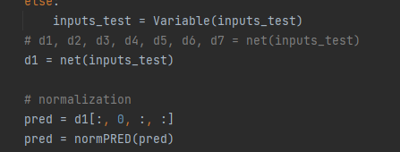
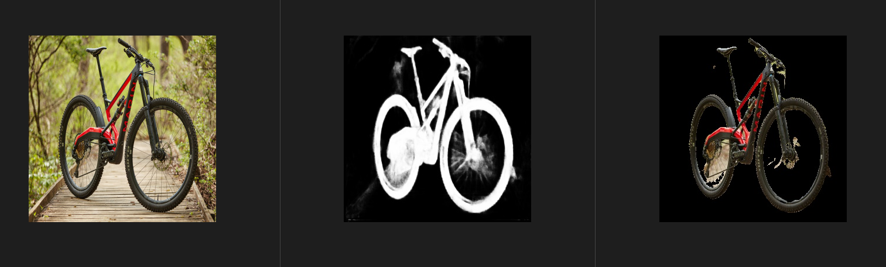
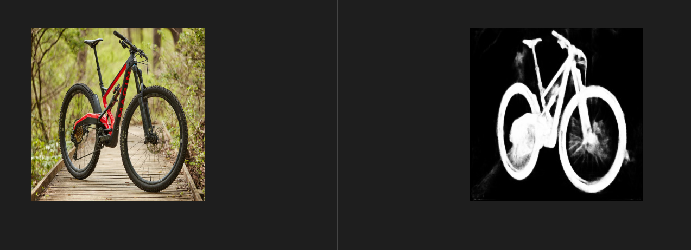

<h1 style="text-align: center">U2Net-rknn</h1>
这个项目基于 U2Net， 使用其网络和预训练模型移植到Rk3588开发板上，完成边缘设备端的图像分割方案。

### 相关项目地址
[U2Net](https://github.com/xuebinqin/U-2-Net): 使用的神经网络模型及权重来源 <br>
[rknpu2](https://github.com/rockchip-linux/rknpu2): rk3588驱动项目<br>
[rknn-toolkit2](https://github.com/rockchip-linux/rknn-toolkit2): rk3588模型移植相关项目<br>

### 注意事项
为了能让模型移植到`RK3588`上，对网络层做了几处修改，并且此项目仅测试了原作者提供的`u2netp`模型，为了降低移植带来的精度损失，所有的操作，仅限于对普通无权重的算子进行了修改和替换。文档下方会具体标注修改处。
### 项目环境
#### 1. 服务器端 (训练/测试/转换环境onnx)
```
    python: 3.8 完全按照U2Net原作者说明的环境
    注意: onnx==1.10.0 protobuf==3.12.2 
    这里刚开始使用protobuf环境在3.19以上出现了，转换环境加载onnx错误的情况
```
#### 2. 转换环境(rknn)
```
    均值: 123.675 116.28 103.53
    方差: 58.395 57.12 57.375
    安装rknn-toolkit2搭建即可。
```

### 3. 测试环境(RK3588)
```
    RK3588使用的固件及转换环境均是v1.5.0, 其他版本未测试。
```

### 模型转换
#### 1. pth 2 onnx
注: 此处为说明，代码中已经修改，无需再次修改<br>
##### 

```
代码来源: U2Net/model/u2net.py line: 22
    原: F.upsample(src,size=tar.shape[2:],mode='bilinear')
    改: nn.Upsample(scale_factor=tar.shape[-1] / src.shape[-1], mode='bilinear')
    原代码此位置不做修改，虽然原模型可能会转换成功，但推理导致rknn commit错误， 虽然无法得出原因，
    在这块修改后onnx将其转换为Resize算子，并有原来的四个缺省参数减少为三个缺省参数，可能是rknn未
    对resize的size参数实现，故使用较常见的scale参数代替，不影响已有网络层和权重。
```

##### 

```
    代码来源: U2Net/model/u2net.py line: 520
    原: return F.sigmoid(d0), F.sigmoid(d1), F.sigmoid(d2), F.sigmoid(d3), F.sigmoid(d4), F.sigmoid(d5), F.sigmoid(d6)
    改: return d1
    此处相当于已经修改了网络头， 取消了原先的对6个结果的合并，进而只获取了一个输出作为结果。
    因为使用原先的输出头会导致结果错误，进而选择了其中一个作为输出头，但网络依旧保留了部分的
    网络特征。可以尝试重新训练并测试目前的网络精度损失。
```
##### 

```
    代码来源: U2Net/model/u2net_test.py line: 115
    这里不过多赘述，为了兼容修改点2的返回值。
    且原网络的 return d1改为 return F.sigmoid(d0)
```

### RKNN测试
```
    [ cpp代码这边随便写的，只为能够最快测试流程和得到结果 ]
    // 交叉编译器自己安装，我这边使用的是aarch64-gcc10.2版本
    
    // 编译
    cd ~/test/cpp 
    mkdir build && cd build
    cmake .. && make
    
    // 运行【注意模型位置及图像路径，代码中修改】生产res.jpg
    ./u2netp_demo 
```

### 结果展示(RK3588)

